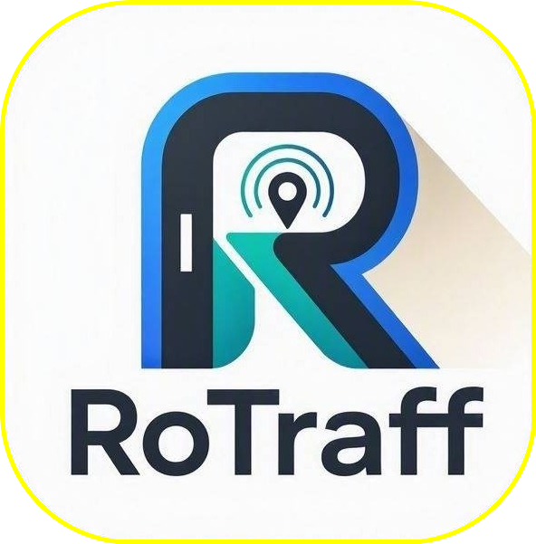

<div align="center">



# RoTraff

**Real-time road intelligence platform for safer driving.**

[](https://react.dev)
[](https://www.typescriptlang.org)
[](https://www.convex.dev)
[](https://stellar.org)
[](https://tailwindcss.com)

[Live Demo](ro-traff-v1.vercel.app) · [Report Bug](https://github.com/your-username/rotraff/issues) · [Request Feature](https://github.com/your-username/rotraff/issues)

</div>

---

## About

RoTraff is a community-driven road safety platform that lets drivers report hazards in real-time, verify incidents collaboratively, and navigate the safest routes. Reports are plotted on an interactive map with risk-scored route planning powered by TomTom and Stellar blockchain rewards for active contributors.

### Key Features

- **Incident Reporting** — Tap the map, select hazard type and severity, upload photo proof, and submit in seconds
- **Community Verification** — Other drivers confirm or downvote reports, building a reliable picture of road conditions
- **Interactive Map** — Real-time incident markers with clustering, heatmaps, and traffic overlays
- **Risk-Based Routing** — Route options (Fastest, Balanced, Safest) scored by nearby incident density and severity
- **ROTR Rewards** — Earn Stellar testnet tokens for verified reports and verification participation
- **Wallet System** — In-app Stellar wallet with QR code receive, transaction history, and on-chain balance
- **Multi-Transport** — Plan routes for car, bicycle, or pedestrian with live travel time estimates
- **Admin Dashboard** — Manage users, review incidents, and monitor platform health
- **Dark Mode** — Full light/dark theme support with glassmorphism UI

## Tech Stack

| Layer | Technology |
|-------|-----------|
| **Frontend** | React 19, TypeScript, Vite, Tailwind CSS v4 |
| **UI Components** | shadcn/ui (Radix UI primitives) |
| **Map** | Leaflet, react-leaflet, OpenStreetMap tiles |
| **Routing** | TomTom Directions API, search, reverse geocoding |
| **Backend** | Convex (serverless functions, real-time queries, mutations) |
| **Auth** | @convex-dev/auth (email/password, OTP, anonymous) |
| **Blockchain** | Stellar SDK, Soroban smart contracts (ROTR token) |
| **Animations** | Framer Motion |
| **Toasts** | Sonner |

## Getting Started

### Prerequisites

- [Node.js](https://nodejs.org/) 18+ or [Bun](https://bun.sh/)
- [Convex](https://www.convex.dev/) account (free tier works)
- [TomTom](https://www.tomtom.com/) API key (free tier: 2,500 requests/day)

### Installation

```bash
# Clone the repository
git clone https://github.com/your-username/rotraff.git
cd rotraff

# Install dependencies
npm install

# Set up environment variables
cp .env.example .env.local
# Edit .env.local with your Convex and TomTom credentials

# Start Convex backend (in a separate terminal)
npx convex dev

# Start the dev server
npm run dev
```

The app will be available at `http://localhost:5173`.

### Environment Variables

| Variable | Description | Where |
|----------|-------------|-------|
| `VITE_CONVEX_URL` | Convex deployment URL | `.env.local` |
| `VITE_TOMTOM_API_KEY` | TomTom API key for maps/routing | `.env.local` |
| `STELLAR_KEY_ENCRYPTION_SECRET` | AES-256 key for encrypting Stellar secrets | Convex Dashboard |
| `STELLAR_ISSUING_SECRET` | Stellar issuing account secret key | Convex Dashboard |
| `STELLAR_DISTRIBUTION_SECRET` | Stellar distribution account secret key | Convex Dashboard |
| `STELLAR_CONTRACT_ID` | CAM3QPJEFVYQ4YF6XNZCFBNHMEWZNKH4QTH54YVBRHYFTPXXNKPG2QGC | Convex Dashboard |

### Stellar Testnet Setup (Optional)

If you want the reward system:

```bash
# Generate keypairs and fund accounts
npx tsx scripts/setup-stellar.ts

# Deploy the Soroban token contract
npx tsx scripts/deploy-soroban-contract.ts
```

Then add the printed environment variables to your Convex dashboard.

## Project Structure

```
rotraff/
├── public/                  # Static assets (logo, manifest)
├── src/
│   ├── components/
│   │   ├── ui/              # shadcn/ui components
│   │   ├── LogoDropdown.tsx # App logo with navigation dropdown
│   │   ├── RequireAuth.tsx  # Auth guard wrapper
│   │   ├── ThemeToggle.tsx  # Dark/light mode toggle
│   │   └── TracingBeam*.tsx # Landing page animated beam
│   ├── convex/
│   │   ├── auth.ts          # Auth providers (password, OTP, anonymous)
│   │   ├── incidents.ts     # Incident CRUD, verification, downvoting
│   │   ├── rewards.ts       # Reward transaction logic
│   │   ├── rewardActions.ts # Stellar payment execution
│   │   ├── wallets.ts       # Wallet provisioning, balance, asset info
│   │   ├── sessions.ts      # Driving session tracking
│   │   ├── users.ts         # User management, roles, admin
│   │   └── schema.ts        # Convex database schema
│   ├── hooks/               # Custom React hooks (auth, mobile, rewards)
│   ├── lib/
│   │   ├── stellar.ts       # Stellar SDK integration (keypair, payments)
│   │   ├── crypto-node.ts   # AES-256-GCM encryption for secret keys
│   │   ├── tomtom.ts        # TomTom API helpers (routes, geocoding)
│   │   └── utils.ts         # cn() helper and shared utilities
│   ├── pages/
│   │   ├── Landing.tsx      # Marketing/landing page
│   │   ├── Auth.tsx         # Sign in / sign up / forgot password
│   │   ├── Dashboard.tsx    # Main map + incident reporting + routing
│   │   ├── WalletPage.tsx   # Stellar wallet, balance, QR receive
│   │   ├── Sessions.tsx     # Driving session history
│   │   ├── Profile.tsx      # User profile settings
│   │   └── AdminDashboard.tsx # Admin panel (users, incidents, system)
│   ├── main.tsx             # App entry point and router
│   └── index.css            # Global styles, Leaflet overrides, glassmorphism
├── scripts/                 # One-time Stellar setup scripts
├── index.html               # HTML entry point
├── vite.config.ts           # Vite configuration
└── package.json
```

## How It Works

### Reporting an Incident

1. Click **Report Incident** on the map
2. Tap the map to place a marker at the hazard location
3. Select incident type (pothole, accident, flood, etc.) and severity
4. Optionally upload a photo as evidence
5. Submit — the incident appears on the map for others to verify

### Community Verification

- Click any incident marker to view details
- **Confirm** (✓) if you've seen the hazard — earns you and the reporter ROTR tokens
- **Downvote** (↓) if the hazard is resolved or inaccurate
- Incidents with enough confirmations become verified

### Route Planning

1. Set origin and destination (search, tap map, or use current location)
2. Choose transport mode (car, bike, walk)
3. Click **Find Routes** — three options are calculated:
   - **Fastest** — shortest travel time
   - **Balanced** — mix of speed and safety
   - **Safest** — avoids areas with high incident density
4. Risk scores factor in nearby incidents and their severity

### Wallet & Rewards

- Earn **ROTR tokens** on Stellar testnet for:
  - Reporting verified incidents
  - Participating in community verification
- View balance, transaction history, and receive tokens via QR code
- Wallet credentials are protected behind password verification

## Scripts

| Command | Description |
|---------|-------------|
| `npm run dev` | Start Vite dev server |
| `npm run build` | Production build |
| `npm run preview` | Preview production build |
| `npm run lint` | Run ESLint |
| `npm run format` | Format with Prettier |
| `npx convex dev` | Start Convex backend (separate terminal) |

## License

This project is private and proprietary. Unauthorized reproduction or distribution is prohibited.

---

<div align="center">

**Built with ❤️ for safer roads**

</div>
